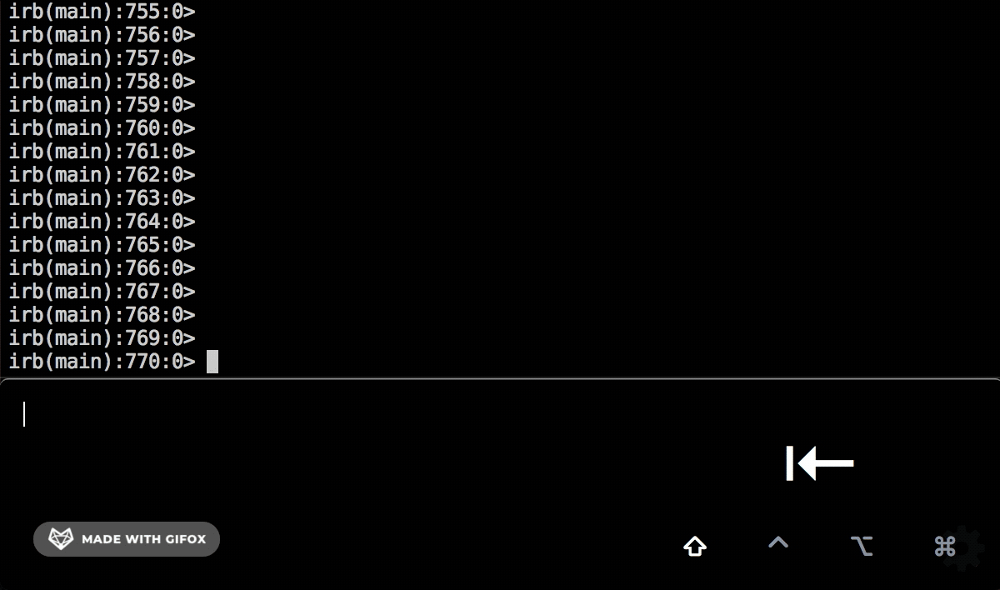

# CodeSlap

If you're like me and you find yourself ssh'ing into a prod console on a daily basis to do some debugging or run once-off scripts, you probably hate your life.
And if the high latency of ssh connections means that you never, EVER, manage to type `Organisationalunit` right the first time, you probably also hate _yourself_.

If you're not lazy you might push to get [mosh](https://github.com/mobile-shell/mosh) installed on your workplace's servers but if you're like me: you _are_ lazy.

CodeSlap lets you push commands to your terminal session from the comfort of a text editor, as if you were directly typing into the terminal itself. The editor is powered by [CodeMirror](https://github.com/codemirror/CodeMirror) meaning familiar keybindings, multi-select, and easy navigation.

## Usage

Press `shift+tab` to toggle between CodeSlap and the application you want to push commands to. Type a command and press `enter` and it will be pushed to your terminal (or whichever application was last focused).



## Installation

Currently for OSX only: you can download the zip file from the releases section. Drag the application to your applications folder.

You will need to allow CodeSlap to 'control your computer' (so that it can switch focus and push your commands to the terminal) like so:


## Settings


### Strip whitespace before period when pasting

Disabled by default.

When this option is enabled, a command like the following:

```
Author
  .find_by(id: 123)
  .name
```

will be converted to `Author.find_by(id: 123).name` when pushing to the terminal. This is useful in a language like Ruby where you would otherwise need to wrap your command in a `begin`/`end` block.

### Single line mode

Enabled by default.

When this option is enabled, the up and down arrow keys will go back and forwards through your command history, and pressing `enter` will push the command.

Whent the option is disabled, the up and down arrow keys will move your cursor and instead you can use `cmd+j` and `cmd+k` to traverse the command history. Pressing `enter` will create a newline, and `shift+enter` will push the command.

### Syntax colouring

Colours your syntax.

### Glob for hints and autocomplete

If you enter a glob into this input and press `sync`, all files matching that glob will be scanned for frequent words and those words will be extracted for use in hinting.
